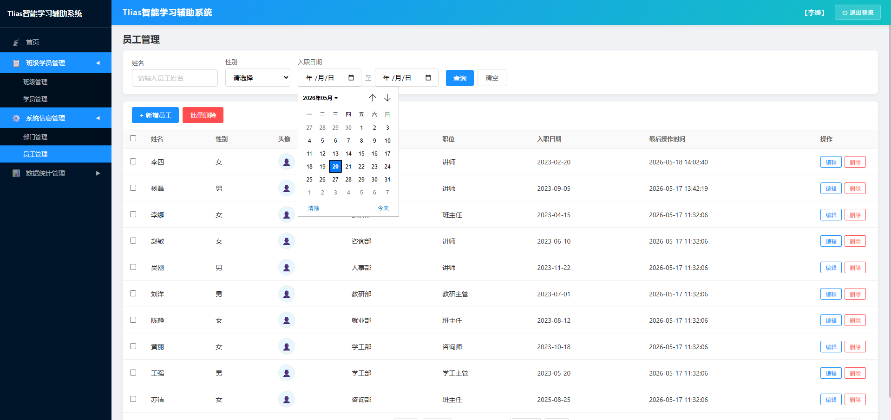
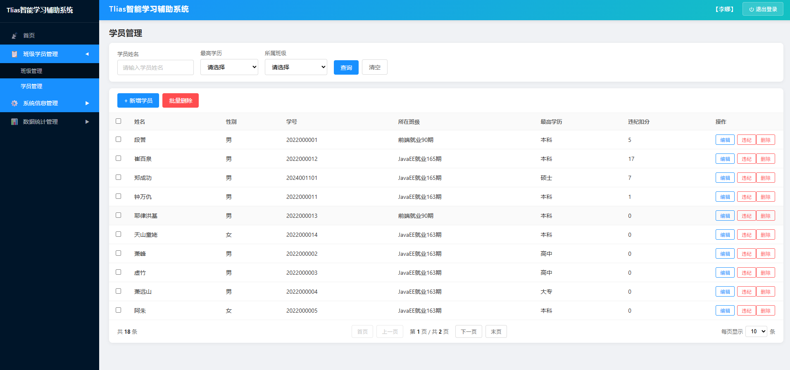
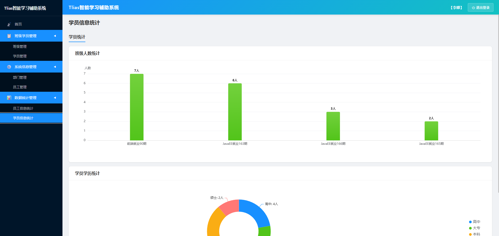

# Tlias 员工管理系统

> 基于 Spring Boot 3.5 + MyBatis + MySQL 的企业级员工信息管理后端服务。

## 项目简介

Tlias 员工管理系统是一套完整的员工信息化管理解决方案，提供**部门管理**、**员工管理**、**班级管理**、**学员管理**、**文件上传**、**数据统计**等核心功能。后端采用标准三层架构开发，通过 RESTful API 与前端交互，使用 JWT 进行身份认证。

## 技术栈

```
后端框架：Spring Boot 3.5.14 / Spring MVC
ORM 框架：MyBatis 3.0.5 + PageHelper（分页插件）
数据库：MySQL 8.x
认证方式：JWT（jjwt 0.11.5）
切面编程：Spring AOP（操作日志记录）
构建工具：Maven
JDK 版本：17
```

## 功能模块

| 模块 | 说明 |
|------|------|
| **部门管理** | 部门 CRUD，支持增删改查 |
| **员工管理** | 员工 CRUD、分页条件查询、批量删除、工作经历关联 |
| **班级管理** | 班级 CRUD、分页查询、状态自动计算（未开班/在读中/已结课） |
| **学员管理** | 学员 CRUD、分页查询、批量删除、违纪扣分 |
| **数据统计** | 员工职位/性别统计、班级学员人数统计、学历分布统计 |
| **文件上传** | 头像图片上传，本地磁盘存储，通过 `/images/**` 访问 |
| **操作日志** | AOP 切面自动记录关键操作日志 |

## 界面预览

| 登录页 | 员工管理 |
|:------:|:--------:|
|  |  |

| 学员管理 | 数据统计 |
|:--------:|:--------:|
|  |  |

## 项目结构

```
tlias-web-management/
├── pom.xml
├── src/main/java/com/lcx/tlias_web_management/
│   ├── TliasWebManagementApplication.java    # 启动入口
│   ├── config/WebMvcConfig.java              # MVC 配置（拦截器、静态资源）
│   ├── interceptor/TokenInterceptor.java     # JWT 认证拦截器
│   ├── controller/                           # Controller 层
│   │   ├── LoginController.java              # 登录
│   │   ├── DeptController.java               # 部门
│   │   ├── EmpController.java                # 员工
│   │   ├── ClazzController.java              # 班级
│   │   ├── StudentController.java            # 学员
│   │   └── UploadController.java             # 文件上传
│   ├── service/                              # Service 层
│   │   ├── DeptService.java / impl/
│   │   ├── EmpService.java / impl/
│   │   ├── ClazzService.java / impl/
│   │   └── StudentService.java / impl/
│   ├── mapper/                               # Mapper 层（MyBatis）
│   │   ├── DeptMapper / EmpMapper / EmpExprMapper
│   │   ├── ClazzMapper / StudentMapper / OperateLogMapper
│   │   └── *.xml                             # SQL 映射文件
│   ├── pojo/                                 # 实体类
│   │   ├── Dept.java / Emp.java / EmpExpr.java
│   │   ├── Clazz.java / Student.java
│   │   ├── Result.java / PageResult.java     # 统一封装
│   │   ├── LoginInfo.java / JobOption.java
│   │   └── OperateLog.java
│   ├── aop/                                  # AOP 切面
│   │   ├── LogOperation.java                 # 自定义注解
│   │   └── OperationLogAspect.java           # 日志切面
│   └── exception/                            # 异常处理
│       ├── BusinessException.java
│       └── GlobalExceptionHandler.java
└── src/main/resources/
    ├── application.yaml
    └── static/                               # 前端静态资源
```

## API 接口一览

| 方法 | 路径 | 说明 |
|------|------|------|
| POST | `/login` | 用户登录 |
| GET | `/depts` | 查询部门列表 |
| POST | `/depts` | 新增部门 |
| PUT | `/depts` | 修改部门 |
| DELETE | `/depts` | 删除部门 |
| GET | `/emps` | 分页查询员工 |
| POST | `/emps` | 新增员工 |
| PUT | `/emps` | 修改员工 |
| DELETE | `/emps/{id}` | 删除员工 |
| DELETE | `/emps/batch` | 批量删除 |
| GET | `/clazz` | 分页查询班级 |
| POST | `/clazz` | 新增班级 |
| PUT | `/clazz` | 修改班级 |
| DELETE | `/clazz/{id}` | 删除班级 |
| GET | `/students` | 分页查询学员 |
| POST | `/students` | 新增学员 |
| PUT | `/students` | 修改学员 |
| PUT | `/students/violation` | 学员违纪扣分 |
| POST | `/upload` | 上传头像 |
| GET | `/emps/countJob` | 统计职位人数 |
| GET | `/emps/countGender` | 统计性别 |
| GET | `/students/countClazz` | 统计班级人数 |
| GET | `/students/countDegree` | 统计学历分布 |

## 快速启动

```bash
# 1. 创建数据库并创建表结构
#    执行 doc/init.sql 将同时创建数据库和所有 6 张表
mysql -u root -p < doc/init.sql

# 2. 修改数据库配置
#    编辑 src/main/resources/application.yaml
#    将 spring.datasource 下的 username 和 password 改为当前环境的数据库账号

# 3. 启动应用
mvn spring-boot:run

# 4. 访问
#    浏览器打开 http://localhost:8080
```

## 项目文档

| 文档 | 说明 |
|------|------|
| [三层架构讲解](doc/三层架构讲解.md) | 后端分层架构详解 |
| [增删改查逻辑与原理](doc/增删改查逻辑与原理.md) | CRUD 实现分析 |
| [AOP面向切面编程详解](doc/AOP面向切面编程详解.md) | AOP 原理与实战 |
| [Cookie-Session-Token详解](doc/Cookie-Session-Token与登录校验详解.md) | 认证机制演进 |
| [MySQL分页查询与分页插件详解](doc/MySQL分页查询与分页插件详解.md) | PageHelper 原理 |
| [Bean详解与第三方Bean配置](doc/Bean详解与第三方Bean配置.md) | IoC/DI/Bean作用域 |
| [SpringBoot起步依赖与自动配置详解](doc/SpringBoot起步依赖与自动配置详解.md) | Starter 与自动配置源码分析 |
| [docker指南.md](doc/docker指南.md) | docker的介绍和项目部署 |
| [Tlias员工管理系统后端总结](doc/Tlias员工管理系统后端总结.md) | 完整项目总结 |
